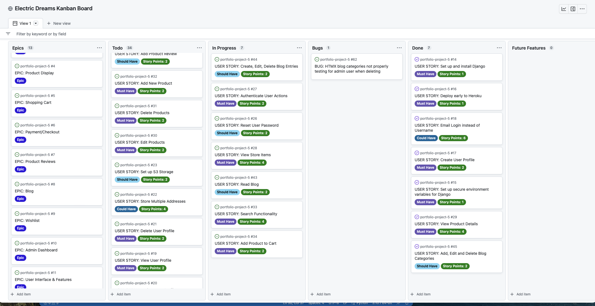

# Electric Dreams

## Introduction

Intro

 

 

[Visit the live website on Heroku here](https://electric-dreams.herokuapp.com/)

 

View information about testing in the [testing.md file here](TESTING.md)

 

## Table of Contents

  * [Introduction](#introduction)
  * [UX](#ux)
    + [Strategy](#strategy)
      - [Epics](#epics)
      - [Translation to User Stories](#translation-to-user-stories)
      - [Agile Management](#agile-management)
    + [Scope](#scope)
    + [Structure](#structure)
      - [Design Structure - Site layout](#design-structure---site-layout)
      - [Information Structure - Database Models](#information-structure---database-models)
    + [Skeleton](#skeleton)
      - [Wireframes](#wireframes)
    + [Surface](#surface)
  * [Features](#features)
  * [Future Features](#future-features)
  * [Technologies Used](#technologies-used)
  * [Testing](#testing)
  * [Notable Bugs](#notable-bugs)
  * [Security](#security)
- [Deployment](#deployment)
- [Credits](#credits)
- [Acknowledgements](#acknowledgements)

## UX

### Strategy

The overall aim of the project is to develop a platform that allows users to create and share book reviews with others around the world.

* Site Goals
    * To enable users to write their own reviews and publish them online
    * To let users browse exsiting reviews for reading ideas
    * To have a design with pleasing visuals and functional layout

* User Goals
The ideal user is excited about reading, looking for new books to read, willing to share their recommendations and wants to interact with with other readers.

#### Epics

At the beginning of the project, thirteen Epics were created and can be viewed at the [Kanban board here](https://github.com/users/neil314159/projects/1/views/1).
* Installation and Setup 
    * As a **developer**, I can **set up django, the necessary software packages and the development environment**, so that **I can deploy the site and begin development**
    * Potential User Stories:
    1. Use the Code Institute template to create a Gitpod workspace
    1. Install Django and libraries for database and web server
    1. Set up environmental variables in a secure fashion using env.py
    1. Deploy to Heroku to test deployment pipeline
* Profiles
    * As a **site user**, I can **create, edit, and delete my account**, so that **I can use the site by logging in**
    * Potential User Stories:
    1. Create a new user account
    2. Log in and view user account
    3. Edit user account details
    4. Delete my own information and account
    5. Reset or update password
    6. Have a profile page showing past orders and Wishlist items
    7. Store multiple addresses for delivery
* Authentication
    * As a **user**, I can **log in and log out**, so that **I can securely access my profile and create, read, edit and delete my own information**
    * Potential User Stories:
    1. Login/logout of account
    2. Verify my email for my new account
    3. I can log in using my social accounts such as twitter or google
    4. My actions are restricted to only allow editing and deleting my own content and not other users
    5. The proper menus are presented to me if I am a customer or admin user of the site
* Product Display
    * As a **user**, I can **view all the products available for purchase**, so that **I can select the items that interest me and view them in more detail**
    * Potential User Stories:
    1. Display all products for sale on the shop page
    2. View products arranged by price, rating, popularity, name
    3. Select a product to view in more detail
    4. View images and a description of the item on a product card
* Shopping Cart
    * As a **user**, I can **add, remove and update items in the shopping cart**, so that **I can decide which products to purchase and the quantity of each product required**
    * Potential User Stories:
    1. Add item to shopping cart
    2. Remove product from cart
    3. Update the quantity of items in the cart
    4. View the total cost of the products in the cart
    5. Go to the checkout page
* Payment
    * As a **user**, I can **pay for the items in my shopping cart**, so that **I can place my order and receive my purchases**
    * Potential User Stories:
    1. Create checkout page
    2. Save the delivery and billing addresses
    3. Use my previously saved addresses
    4. Create a new user account to save customer info
    5. Accept card details and show payment confirmation
    6. Send email with order details to customer
* Product Reviews
    * As a **customer**, I can **write reviews on products I have purchased**, so that **I can inform other potential customers about the product**
    * Potential User Stories:
    1. Customers can add a new review to a product they have purchased
    2. Customers can edit their reviews
    3. Customers can view their reviews on the product page
    4. Customers can remove their reviews
    5. Site administrators can remove reviews
    7. Customers can use text and ratings in their review
    8. Ratings will be averaged among all reviews and displayed on the product page
* Blog
    * As a **customer**, I can **read articles on the blog section**, so that **I can understand more about the products and the shop selling them**
    * Potential User Stories:
    1. Create blog section for website
    2. Implement blog posts and categories
    3. Add rich text and images to post
    4. Allow user comments on blog posts
    5. Add full CRUD functionality for blog posts and comments
* Wishlist
    * As a **user**, I can **add products to my wishlist**, so that **I can purchase them at a later date**
    * Potential User Stories:
    1. Customers can add/remove products to the wishlist by clicking an icon on the product page
    2. By logging in to their profile page users can see their wishlist     
* Admin Dashboard
    * As a **site administrator**, I can **log in to the admin dashboard**, so that **I can manage products, orders and blog posts for the site**
    * Potential User Stories:
    1. Add, edit and delete products
    2. Add, edit and delete blog posts
    3. Add, edit and delete blog categories
    4. View all orders, shipped and unshipped
    5. Mark orders as shipped
    6. View graph of past orders    
* User Interface and Features
    * As a **site owner**, I can **ensure that the site design is functional and pleasing, and that all necessary e-commerce features are present**, so that **customers can get the maximum benefit from visiting and using the site**
    * Potential User Stories:
    1. Create colour scheme
    2. Choose typography
    3. Implement bootstrap theme
    4. Add XML sitemap
    5. Add privacy policy
    6. Add 404 page
    7. Add newsletter signup form
    8. Add custom order contact form

* Social Media and Marketing
    * As a **site owner**, I can **advertise my site using social media and other techniques**, so that **customers will hear about the site and purchase products**
    * Potential User Stories:
    1. Perform keyword research for marketing efforts and use in meta tags
    2. Create Facebook page
    3. Create Twitter account
    4. Create Instagram account
    5. Create newsletter signup form
    6. Connect to Twitter API to automatically post new products to the shop's Twitter feed

* Testing
    * As a **developer**, I can **perform automated and manual testing**, so that **I can reduce the number of bugs and protect the data of my customers**
    * Potential User Stories:
    1. Create automated test suites for main Python functions
    2. Draw up and carry out a manual testing plan for all functional aspects of the site
    3. Enlist a 3rd Party user to test out the site and offer feedback
    4. Perform validation of all HTML, JS and CSS code
    5. Format all Python code to conform with standards
 

#### Translation to User Stories

1. Installation and Setup
    * USER STORY: Setup and Install Django #14 - As a developer, I can set up django and the necessary software packages, so that I can deploy the site and begin development
    
    * USER STORY: Set up environmental variables securely #15- As a developer, I want to set up the Django secret key and database variables in the env.py file, so that they are kept secure during deployment and not accidentally exposed

    * USER STORY: Deploy early to Heroku #16 - As a developer, I want deploy the site to Heroku soon after installation, so that I can ensure that the development pipeline is functioning and I can work on the main features of the site

    * USER STORY: Set up S3 Storage #23 - As a developer, I can store my static images and files in the cloud, so that they can be quickly accesses and served to website users

1.  Profiles
    * USER STORY: Create User Profile #17- As a user, I can create a profile on the site, so that I can save my personal details such as addresses, use the wishlist and commenting features, and view past orders

    * USER STORY: Email Login instead of Username #18 - As a user, I can register and use an account with just my email address, so that I don't have to remember and manage a username as well

    * USER STORY: View User Profile #19 - As a user, I can log into the site and view my own profile page, so that I can see past orders, my address, my wishlist

    * USER STORY: Update User Profile #20 - As a user, I can view my own profile page, so that I can edit my own personal details such as email address and shipping or billing address

    * USER STORY: Delete User Profile #21 - As a user, I can delete my profile from the site, so that ** I can remove or protect my personal information

    * USER STORY: Store Multiple Addresses #22 - As a user, I can store multiple addresses on the site, so that I can select my desired shipping or billing address at the time of checkout

1.  Authentication
    * USER STORY: Authenticate User Login/Logout #24 - As a user, I can log and and log out of the site, so that my personal information is secure
    * USER STORY: Social Media Login #25 - As a user, I can use my social accounts such as Twitter or Facebook or Google to sign in, so that I can consolidate my accounts and avoid creating new passwords
    * USER STORY: Reset User Password #26 - As a user, I can reset my password, so that can regain access my account if my password is lost or forgotten

    * USER STORY: Authenticate User Actions #27 - As a developer, I want to only allow certain actions to be carried out when the correct user is logged in, so that users are restricted to accessing and updating their own information and not that of others

1.  Product Display
    * USER STORY: View Store Items #28 - As a user, I can view all items for sale, so that I can choose the items I want and add them to my cart

    * USER STORY: View Product Details #29 - As a user, I can click on the thumbnail of a product, so that I can see in-depth information on the product and add it to my cart

    * USER STORY: Edit Products #30 - As a site owner, I can edit the details of any product on the site, so that product information can be updated or corrected when necessary

    * USER STORY: Delete Products #31 - As a site owner, I can delete products from the site, so that old products can be removed

    * USER STORY: Add New Product #32 - As a site owner, I can add products to the site, so that new items are made available for sale to customers

    * USER STORY: Search Functionality #33 - As a user, I can search for products on the site, so that find the products I wish to purchase

1.  Shopping Cart
    * USER STORY: Add Product to Cart #34 - As a user, I can add products from the store to my shopping cart, so that I can purchase them later
    * USER STORY: Edit/Remove Shopping Cart Items #35 - As a user, I can update the quantity of, or remove items from the shopping cart, so that I can purchase the products I wish in the correct quantity

    * USER STORY: View Shopping Cart #36 - As a user, I can **view all the items in my shopping cart, so that ensure I purchase the correct products

    * USER STORY: Coupon Code #60 - As a user, I can enter a coupon code at the checkout, so that I can receive a discount on my order

    * USER STORY: Purchase Recommendations #61 - As a user on the site, I can view items that other customers also purchased when viewing a product page, so that I can be advised abut products that go well together and I might like to purchase

1.  Payment
    * USER STORY: Checkout Page #37 - As a user, I can use the checkout page to pay for my purchases, so that I can receive the products

    * USER STORY: View Order Details #38 - As a user, I can view the details of my order, so that I can see that my order has been processed successfuly

    * USER STORY: PDF Receipt #39 - As a user, I can download a PDF receipt for my order, so that I can save it for future reference

1.  Product Reviews
    * USER STORY: Add Product Review #40 - As a user, I can write a review for a product I have previously purchased, so that other users may see my feedback on these products

    * USER STORY: Edit/Delete Reviews #41 - As a user on the site who has written a review, I can edit or delete the reviews, so that I can update my reviews with new information or remove personal information

    * USER STORY: Calculate Product Ratings #42 - As a user, I can see the average score of all reviews left on a product, so that **make an informed decision about my purchase

1.  Blog
    * USER STORY: Read Blog #43 - As a user, I can read the blog section of the site, so that learn and understand more about the products for sale on the site

    * USER STORY: Create, Edit, Delete Blog Entries #44 - As a site owner, I can add, update and delete blog entries on the site, so that customers can benefit from accurate and up-to-date information

    * USER STORY: Add, Edit and Delete Blog Categories #45 - As a site owner, I can add, edit and remove blog categories, so that blog posts are correctly categorised and easily accessed

1.  Wishlist
    * USER STORY: Add/Remove Wishlist Items #46 - As a user, I can add or remove items from my wishlist, so that I can keep track of products I wish to purchase in the future
 
    * USER STORY: View Wishlist on Profile Page #47 - As a user, I can click on the link to my profile page, so that I can see at a glance all the items stored in my wishlist

1.  Admin Dashboard
    * USER STORY: Admin Dashboard #48 - As a site owner, I can view a dashboard outlining admin functions, so that I can save time and effectively manage the site

    * USER STORY: Set Order Status #49 - As a site owner, I can log into the admin dashboard of the site, so that I can update the status of each order to reflect if it has been shipped

    * USER STORY: Order Chart #50 - As a site owner, I can see a chart representing all recent orders, so that I can see at a glance the relative number of sales made on the site

    * USER STORY: Printable Shipping Labels #51 - As a site owner, I can print a list of shipping labels for all unshipped orders, so that customers can receive their orders quickly

1.  User Interface and Features
    * USER STORY: Site Requirements #52 - As a site owner, I can ensure that all necessary pages are added to the e-commerce site, so that customers can benefit from the full functionality of the site

    * USER STORY: Custom Product Form #53 - As a customer, I can send a request for a product to be added to the site, so that I can purchase a product customised to my needs

1.  Social Media and Marketing
    * USER STORY: Keyword Research and SEO #54 - As a site owner, I can research relevant keywords for my site, so that I can carry out effective SEO and social media marketing

    * USER STORY: Social Media Marketing #55 - As a site owner, I can create pages on major social media outlets, so that customers can learn about the store and products offered for sale

    * USER STORY: Twitter API Integration #56 - As a site owner, I can automatically post new products and blog posts to Twitter, so that customers can tay up-to-date on everything offered by the store

1.  Testing
    * USER STORY: User Testing #57 - As a developer, I can ask a person who has never used the site before to test it while I watch, so that **I can gather feedback about the usability and functionality of the site

    * USER STORY: Manual Testing #58 - As a developer, I can develop a plan to manually test every aspect of the site's functionality, so that users can have a bug-free experience

All of the completed user stories are available on the Kanban board found [here](https://github.com/users/neil314159/projects/1), where the acceptance criteria and implementation criteria for each story are visible by clicking on each individual issue. 
 

 

#### Agile Management

An agile approach was taken to development. First the epics were devloped and potential user stories were created from that basis. Then the user stories were defined, and each was assigned acceptance criteria and task lists to be completed. The Kanban tracking board was used to manage the user stories and bugs that arose. Each task was also assigned a priority label of Must Have, Could Have and Should Have, with unfinished or future tasks being marked as Won't Have. User points were also set for each User Story.

 

 

### Scope

AFter going through the process of creating and refining the epics, and then translating into user stories, this provided a high-level view of the project where the discrete technical features could be defined. These were as follows:
* Products - can be created, viewed, edited and deleted by site owner, viewed and purchased by users
* Blog - can be created and managed by site owner
* Comments - can be left and deleted by users
* Wishlist - items can be added and removed  by users
* Requests - users can make custom request thorugh feedback forms
* Dashboard - central area for managing operation of site

### Structure

#### Design Structure - Site layout
* A simple and straightforward site layout was adopted to make the site easy for users to navigate.
* All forms for creating, editing, viewing and deleting information are simply presented and easy to understand.

#### Information Structure - Database Models

A number of custom models were created for this project:

* Custom User model - the original project used in the course utilised a One-to-One profile model to store customer data such as telephone address etc. One of the features I really wanted to implement is the ability for a user to sign on using only their email address instead of a username. This makes things easier for the user since they don't have to remember or record an extra username. This is only possible by extending the standard Django user model and altering the authentication to use an email address instead of a username when signing up.  The user model was based off Django AbstractUSer and added extra fields to be stored in the database.

* Wishlist item - this model links users and products and allows them to store a lost of possible future purchases

* Blog Post - for representing posts made on the website blog
* Blog Category - to allow for categorisation of the posts
* Comment - to allow for user comments and reviews, connected to the product model

* ArtRequest - stores messages sent in by users from the comment form making suggestions or requests

The entire schema is visible here:

### Skeleton

#### Wireframes
Balsamiq was used to create the wireframes for this project. The initial layout of the site remained largely the same during the development process, except for the profile page and the wishlist being separated into two pages rather than combined into one. The wireframe for the review index page was also used for the search results and category view pages as they are functionally very similar.

* Homepage

* Review Listing

* Review Detail

* Profile/Wishlist Page

### Surface

* Fonts - 
Initially I wanted to use a standard system font in keeping with the general technological theme of the site, but after user testing feedback I moved to using Nunito Sans, which provides a slightly more refined look for the user interface and works well for an ecommerce site such as this.

* Images - 
Since the purpose of the site is to sell visual posters and prints, no other extraneous images were used elsewhere as they would distract from the products for sale.

* Colours - 
The colour scheme was kept extremely clear and simple so as not to take away from the artwork images being displayed. A clean white background was deemed the best after testing various colour combinations to allow the images to stand out most clearly.

## Features

### User Features

#### * Homepage
The homepage has eye-catching visuals to grab the user's attention. It explains the purpose of the site and links them to the shop so they can start browsing right away.

#### * Dynamic Updating Elements
The homepage automatically pulls in the latest products and blog posts that have been created. The home page dynamically updates so that the content doesn't become stale, users can always see the newest products and content posted on the site.

#### * Product Listing
The shop page lists all of the products available on the site at a glance. it can be viewed by category from the navbar menu if the customer wishes. It shows an overview of the product along with the price and rating. The products can be ranked by price, name and rating and the content updates instantly without refreshing the page.

#### * Product Detail
This page shows the detailed information about the product to the user. It allows them add the product to their shopping cart, add it to their wishlist if they are logged in, and to leave a comment below the listing. The wishlist button toggles to reflect the state of being added or removed.

#### * Live Search
The search Page searches through all the products on the site,  looking at their names and descriptions. The search page is live, so it instantly updates the search after a user keypress.

#### * Navigation Menu
The nav menu lets customer log in or register in the top portion. The bottom half offers shortcuts to the various pages on the site, such as the shop, the blog, their wishlist etc.

#### * Footer with Newsletter Signup
The footer offers shortcut links to the various pages on the site. It allows users to visit the company social media pages. There is a signup form connected with a Mailchimp newsletter.

#### * Blog
The blog page, accessed from the navbar menu shows an overview of all blog posts available on the site. They can also be browsed by category.

#### * Blog Post
The blog post page shows each individual log post for the customer to read.

#### * Custom Request Form
The request form allows the user to make suggestions or come up with ideas for new artwork on the site..

#### * Privacy Policy
The privacy policy explains the rights of the user under current legislation..

#### * Comments
The comments section allows users to leave feedback and reviews on products. A logged in user can delete their own comments.

#### * Wishlist
The wishlist view shows all of the products the user has added to their wishlist.

#### * Orders Page
The orders page lets the user see all past orders and note whether it has been shipped or not by visual indicators..

### Admin Features

#### * Admin menu
The admin menu is accessed from the top right beside the login/register button.

#### * Product Management Page
This page allows the site ownder to directly add, edit and remove product categories. They can be edited in place without refreshing. They can also see links to view, edit or delete products in the store directly.

#### * Order Management Page
The order page shows all orders made on the site ranked by date. It shows if they are shipped or not, and there is a button to toggle this state, which is reflected right away..

#### * Blog Management Page
The blog management page functions similarly to the product page and offers shortcuts for managing the blog contents.

#### * Request Management Page
This page shows all requests that have been made through the feedback form, they can slso be deleted from here.

## Future Features

There are a number of features which I would like to implement in the future for this website. They were left out due to being beyond the scope of this project in terms of time and complexity. The Kanban project board for this site tracks all the features and you can see a list of which issues have beenleft for future devleopment. [Kanban Board](https://github.com/neil314159/portfolio-project-4/projects/1) 

* Product Recommendation - most large-scale e-commerce retailers owe a large part of their success to recommending additional products to users which they are likely to buy. The main additional feature I would like to implement for this project is an affective algorithm to recommend purchases based on previous purchase history and the products in the shopping cart right now. Most real-world implementations of this feature use a databse to store a matrix of all lproducts, and then look for patterns of products clustered together. Some recommendation engines are quite complex and sophisticated, but can obviously lead to extra additional profits for any retailer.

* Artwork via API - the core idea of the site is selling artwork that have been generated by artificial intelligence. Currently, using these generator engine requires you to login directly to the website of the company supplying it. These services are not yet available via API, but when they eventually are, it means that a customer could enter a prompt or description of the poster they want to buy and have it generated dynamically for them on the spot before buying. The only downside is that the image can sometimes take a minute or two to generate, which may be too long for a casual customer. It should be noted that the text equivalents of these services such as GPT-3 are already avaialble via API, so I expect the visual services to follow suit.

* PDF generation - a feature that I really wanted to implement for this site is the ability to generate PDFs dynamically, so that the customer can download the receipt or have it emailed to them after their purchases. The generation of PDFs is dependent on a large number of third-party libraries, and while the feature worked locally on my own machine it proved unstable and resource-hungry when deployed to Heroku. The libraries could not be guaranteed to work every time and sometimes were very slow to generate the PDF, leaving the user waiting.

* Twitter API Integration - when adding new products to the site it is a good opportunity for the site owner to also automatically promote the product on social media. It is relatively easy to integrate with Twitter and send pictures and text programmatically. I signed up for the API and was able to send tweets when adding products to the database, e.g. automatically link back to the site with a picture of the newly added product, but unfortunalty due to a programming error I sent out thousands of duplicate tweets in a short time and got my developer account limited for review. I believe this would be a useful feature in the future and could be easily implemented. The Tweepy library for Django works well here. Unfortunately most other social media networks do not allow content to be posted directly via API.

* Charts for Dashboard - the administrative dashboard for the site was a large part of the project, allowing management of products and blog posts. It would be possible to integrate a charting library and display a visual record of sales for the last month for example.

## SEO & Marketing

### Social Media Strategy
facebook, twitter, instagram

### SEO
Keywords, tags, content stratgy

## Technologies Used

* Python
    * These Python modules were used for the project:
       * asgiref==3.5.2
       * cloudinary==1.29.0
       * *crispy-bootstrap5==0.6
       * dj-database-url==1.0.0
       * dj3-cloudinary-storage==0.0.6
       * Django==3.2.15
       * django-allauth==0.51.0
       * django-countries==7.2.1
       * django-crispy-forms==1.14.0
       * django-htmx==1.12.1
       * gunicorn==20.1.0
       * mailchimp-marketing==3.0.75
       * oauthlib==3.2.0
       * Pillow==9.2.0
       * psycopg2==2.9.3
       * PyJWT==2.4.0
       * python3-openid==3.2.0
       * pytz==2022.1
       * requests-oauthlib==1.3.1
       * sqlparse==0.4.2
       * stripe==4.0.2

* Midjourney
    * all of the genrative art used on the site was created using the Midjourney engine. This is a recently developed platform, similar to the more widely known Dall-e@, which allows the user to enter a prompt or description and have visual art created for them on the spot. While there are some teething issues, in general the quality is extremely high and surprising to casual users.
* Heroku
    * The project was deployed using Heroku's cloud-based platform
* Heroku PostgreSQL
    * The database functionality was provided by the Heroku Postgres Add-on, in this case the free hobby-level package
* Django
    * Django is a high-level Python framework used to develop and deploy websites, noted for easily handling user authentication and handling user data
* Stripe
    * payment handling is essential for any store, and the Stripe library allows for the easy processing of payments to be integrated into the site. They have extensive documentation and developer tutorials
* Sendgrid
    * The SendGrid API allows Django to send out emails for user account operations. A service like this is essential as a store scales up and personal email setups can no longer be used to deliver large volumes of email.
* Mailchimp
    * In contrast to Sendgrid, which is used for large-volume transactional email, Mailchimp is used fo rnewsletter managemnt. It is capable of quite sophisticated stratgeies to segment customer lists, send out automated marketing and offers conditonal on user behaviour.
* Cloudinary
    * used for handling static storage and well-known for their image-processing abilities
* AllAuth
    * used for handling user registration and authorisation management. It takes over these tasks from the Django native impelementation, and makes it much easier to handle tasks such as verifying email addresses  and resetting passwords.
* HTML
    * HTML was used mainly to style the templates used by Django for displaying the front end of the site.
* CSS
    * A small amount of CSS was written to style the background and fonts for the project.
* Bootstrap
    * A comprehensive CSS framework used to quickly provide layout and styling for web pages
* Font Awesome
    * The Font-Awesome icon library was used for the social media links in the footer of the site.

#### Other Resources Used
* [Github](https://github.com) 
    * GitHub is used for version control and as a repository for the code of the project.
* [Gitpod](https://gitpod.io) 
    * Gitpod was the development environment for this site and linked to Github for storage and deployment.
* [MacOS Preview](https://support.apple.com/guide/preview/welcome/mac)
    * All screenshots were captured and edited with this program.
* Balsamiq
    * Used to develop and refine wireframe images in the planning stage of the project.
* Cloudinary API Reference
    * This was used to understand how to apply image transformations when uplaoding and storing images on their service.

## Testing

A manual tetsing plan was developed for this project. A spreadsheet was used to define all the paths that could be taken through the software by a user. This list of scenarios was used throughout development to check for errors and guide bug-fixing when problems were revealed. The acceptance criteria as defined in the user stories were also examined to ensure compliance. A full overview of the testing process can be found here in [TESTING](TESTING.md). 

## Notable Bugs

1. User Model
    * Early in the project, I decided to use a custom user model. The main reason for choosing this model was so that a user could use their email address to sign on rather than a username. I didn't appreciate at the time that changing the user model can have downstream effects, and once the project is started, is difficult to roll back. I had some problems integrating the code for the checkout and payment system after changing to the new model These kinks were eventually worked out, but in the future I would think more carefully about the best model to represent user data and how it will interact with rest of the system.

# Deployment

## Creating the Project
1. A new repository was created for the project on GitHub by clicking 'New Repository' on the GitHub user page, giving a name to the project.
1. The GitPod link created by the Chrome extension was clicked on the Code Institute Python template found [here](https://github.com/Code-Institute-Org/python-essentials-template).
1. This created a virtual workspace which was then linked to my GitHub account.
1. After writing code for the project, I used git commands add, commit and push which sent all the project files from GitPod to my GitHub repository.

## Deploying to Heroku
The project was deployed on the Heroku site by using these steps:
1. Create a new account on Heroku.
1. Log into your account.
1. Click on the 'New' button and click 'Create New App'.
1. Choose a new name for your app, which must be globally unique to your app.
1. Select the Resources menu option from the top of the page.
1. Search in the Add-ons search box for Heroku Postgres.
1. Select the Heroku Postgres Add on from the results list and accept the hobby level tier.
1. Click on the settings tab and go to the hidden variables section.
1. Here you can add your SECRET_KEY variable which is hidden within the env.py in your Django project. It is a good idea to generate a new secret key rather than using the default one.
1. Make a note of the DATABASE_URL so that you can use it in your own env.py to connect directly to the Heroku databse during development.
1. You can also add a key for static storage such as Cloudinary or S3.
1. Click the Deploy tab in Heroku.
1. Connect your project to your Github Repository and select automatic deployment. This will deploy your project after every time you push your changes to Github.
1. For an e-commerce project such as this, you will need to use Stripe or another payment provider. 
1. Once you sign up with a payment provider, add their API keys to the secret variables section on Heroku and in your own env.py file.

## Local Deployment

#### Forking the repo on GitHub
1. Navigate to the Github page and log into your GitHub account.
1. Navigate to the project page found [here](https://github.com/neil314159/portfolio-project-5).
1. Click on the 'Fork' icon on the upper right hand side of the screen.
1. This makes a copy of the code in your own repo so you can examine it or open it in an IDE.

#### Download a zip file of the source code
1. Click this [link](https://github.com/neil314159/portfolio-project-5) to the project home page.
1. Click the 'Code' button on the right hand side.
1. Select "Download Zip' option from the menu.
1. Unzip the files on your own machine.
1. Open them in the development environment of your choice.

# Credits

## Pictures

* All pictures used on the site as product photos were generated using the Midjourney AI picture generator. This is available to the public and operates through a discord server. [Midjourney](https://www.midjourney.com)

## Coding Inspiration

[Bug Bytes](https://www.bugbytes.io/) - this website and YouTube channel provided a good overview of Django development and the techniques on how to use HTMX in the context of designing websites  
[William Vincent Django for Professionals](https://wsvincent.com/) - His book Django for Professional gives a good overview of how to implement custom user models and incorporate them into the signup flow for the website. 
[Bootstrap Examples](https://getbootstrap.com/docs/5.2/examples/) - The example code provided here gave ideas on how to lay out and refine the presentation of the site.  
[Stack Overflow](https://stackoverflow.com/questions/65365131/letting-users-delete-their-own-accounts-in-django) - this was used for many queries relating to jungle, for example this question on how to allow the user to delete their own account.

# Acknowledgements

* Thanks to Code Institute mentor Daisy McGirr for all of her advice and guidance.